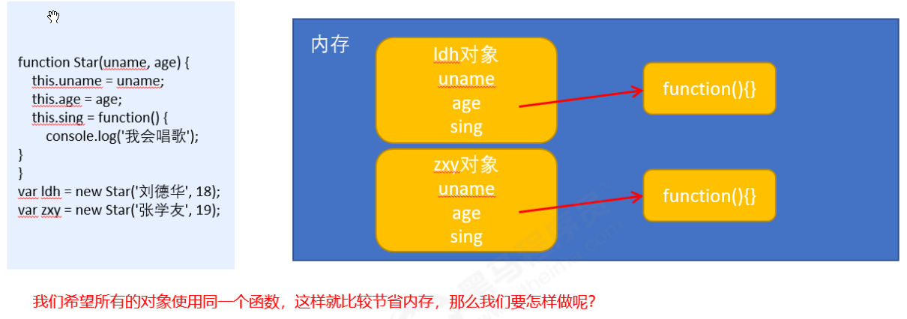
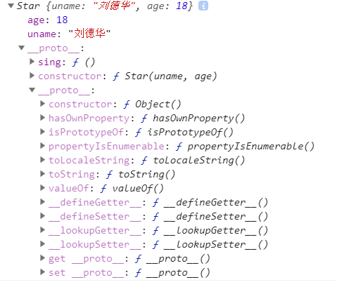

#### 构造函数和原型

 1.  创建对象的三种方式：字面量，new关键字，构造函数

      +  ```javascript
          var obj1 = {};
          var obj2 = new Object();
          
          function Person(name1, age1){
            this.name = name1;
            this.age = age1;
          }
          var obj3 = new Person('zs', 24)
          ```

 2.  静态成员和实例成员

     + 
          ```javascript
          1. 实例成员   就是构造函数内部通过this添加的成员； 如上面代码中的 name， age就是实例成员， 他们只能通过实例化的对象来访问
          2. 静态成员   就是在构造函数本身上添加的成员， 例如下面的sex就是静态成员， 只能通过构造函数访问
          Person.sex = '男'
          ```

 3.  构造函数方法的问题， 浪费内存

     + 

 4.   prototype，\__proto__，constructor

      + 所有的函数都有一个prototype属性， 它是一个对象(本质上它是一个地址，指向一个对象)， 这个对象的用途共享所有的属性和方法 给对象实例

      + 所有的对象都有一个\__proto__属性， 这个属性指向构造函数的原型， 它是一个非标准属性， 但是为对象的查找机制提供了一个方向， 它指向构造函数的原型对象

      + constructor属性，  对象的原型\__proto__和构造函数的原型对象prototype都有的一个属性   指回构造函数本身

       ```javascript
           // 函数一创建  js就会自动给它添加一个 prototype属性 (原型对象),
           // 原型对象里面有些公用的属性和方法 所有的实例都可以共享
           function Star(uname, age) {
               this.uname = uname;
               this.age = age;
           }
           console.dir(Star)
           Star.prototype.sing = function() {
               console.log('我会唱歌');
           }
           var ldh = new Star('刘德华', 18);
           var zxy = new Star('张学友', 19);
           ldh.sing();
           // 所有的对象都有一个 __proto__ 属性， 执行构造函数的原型对象
           console.log(ldh); // 对象身上系统自己添加一个 __proto__ 指向我们构造函数的原型对象 prototype
           console.log(ldh.__proto__ === Star.prototype);
           
           //对象的构造函数 指向创建这个对象的构造函数
           console.log(ldh.constructor === Star)
           
           //使用注意点
           Star.prototype = {
               // 如果我们修改了原来的原型对象,给原型对象赋值的是一个对象,则必须手动的利用constructor指回原来的构造函数
               constructor: Star,
               sing: function() {
                   console.log('我会唱歌');
               },
               movie: function() {
                   console.log('我会演电影');
               }
           }
       ```

      

5.   原型链

       + 每个对象实例都有一个\__proto__属性， 这个属性指向构造函数的原型对象，构造函数的原型对象也是一个对象， 也有\__proto__属性， 这样一层一层向上找，形成了原型链
     
       ```javascript
         function Star(uname, age) {
             this.uname = uname;
             this.age = age;
         }
         Star.prototype.sing = function() {
             console.log('我会唱歌');
         }
         var ldh = new Star('刘德华', 18);
         console.log(ldh.sing());
         console.log(ldh.toString());
         console.log(ldh);
       ```
    
       + 

6. 内置对象上添加方法
   + `Array.prototype.selfMethod = function(){}`
   + `Object.prototype.selfMethod = function(){}`
   + 使用要小心， 一定注意名字不能和系统的一些方法名冲突，不然导致其他同事写的代码无法使用

#### 继承

1. call方法，   一种调用函数的新的方式，函数里面的参数可以改变函数的this指向，里面的参数使用逗号分隔

2. 借用父构造函数继承属性   

     ```javascript
      // 1. 父构造函数
      function Father(uname, age) {
          // this 指向父构造函数的对象实例
          this.uname = uname;
          this.age = age;
      }
      // 2 .子构造函数 
      function Son(uname, age, score) {
          // this 指向子构造函数的对象实例
          Father.call(this, uname, age);
          this.score = score;
      }
      var son = new Son('刘德华', 18, 100);
      // 这个uname属性不是Son构造函数里面的， 而是父构造函数Father里面的， 通过call调用，son继承了父构造函数的属性
      console.log(son.uname)
      console.log(son)
     ```

3. 借用原型对象继承方法

   ```javascript
      // 改进的原因是因为 上面的步骤结束后  son不能继承Father构造函数的原型对象上面的方法，
      // 这里需要手动改变一下Son构造函数的原型对象 才能继承父构造函数的原型对象上面的一些方法
      // 有一个注意点  赋值是 使用用 new Father()，创建一个对象出来 赋值给Son的原型对象prototype； 不能使用 Son.prototype = Father.prototype  改一个另一个也跟着改变，会有bug
      
      // 借用父构造函数继承属性
      // 1. 父构造函数
      function Father(uname, age) {
          // this 指向父构造函数的对象实例
          this.uname = uname;
          this.age = age;
      }
      Father.prototype.money = function () {
          console.log(100000);
      
      };
      // 2 .子构造函数 
      function Son(uname, age, score) {
          // this 指向子构造函数的对象实例
          Father.call(this, uname, age);
          this.score = score;
      }
      //Son.prototype = Father.prototype; //这样直接赋值会有问题, 如果修改了子原型对象, 父原型对象也会跟着一起变化
      Son.prototype = new Father();
      // 如果利用对象的形式修改了原型对象,别忘了利用constructor 指回原来的构造函数
      Son.prototype.constructor = Son;
      // 这个是子构造函数专门的方法
      Son.prototype.exam = function () {
          console.log('孩子要考试');
      }
      var son = new Son('刘德华', 18, 100);
      console.log(son);
      console.log(Father.prototype);
      console.log(Son.prototype.constructor);
   ```


#### ES5新增方法

1. forEach，filter，some， trim

     ```javascript
     // forEach 迭代(遍历) 数组
     // 以前的遍历数组  for 计数器,  
     // 遍历对象       for...in
     var arr = [1, 2, 3];
     var sum = 0;
     arr.forEach(function (value, index, array) {
         console.log('每个数组元素' + value);
         console.log('每个数组元素的索引号' + index);
         console.log('数组本身' + array);
         sum += value;
     })
     ```

     ```javascript
     // filter 也是查找满足条件的元素 返回的是一个数组 而且是把所有满足条件的元素返回回来
     
     // 找出两个数组中相同的元素
     var arr1 = [1, 2, 3, 4, 5, 6];
     var arr2 = [2, 23, 12, 4, 7, 8, 43]
     var arr3 = arr1.filter(function(item) {
         return arr2.indexOf(item) >= 0;
     })
     console.log(arr3)
     
     // 数组去重
     var arr = [12, 66, 4, 88, 3, 7, 12, 66, 23, 23, 2, 12, , 3, 3, 2, 9];
     var newArr = [];
     arr.filter(function (item, index) {
       	console.log(newArr)
         if (newArr.indexOf(item) == -1) {
             newArr.push(item)
         }
     });
     console.log(newArr);
     ```

     ```javascript
     //some 也是查找满足条件的元素是否存在  返回的是一个布尔值 如果查找到第一个满足条件的元素就终止循环
     // forEach和some； 在查询数组中的惟一的元素的时候， 用some更适合，执行效率更高；遇到return就终止遍历； forEach里面return不会终止迭代
     var arr1 = ['red', 'pink', 'blue'];
     var flag1 = arr1.some(function(value) {
         return value == 'pink';
     });
     console.log(flag1);
     ```

     ```javascript
     // 只会去除字符串两端的空格， 中间的不去， 后面的正则可以
     var str = '  hel l o  ';
     console.log(str.trim())
     ```

2.  `Object.keys(obj),  Object..values(obj), Object.entries(obj)`

      ```javascript
      var obj = {
          id: 1,
          pname: '小米',
          price: 1999,
          num: 2000
      };
      console.log(Object.keys(obj)); //  ["id", "pname", "price", "num"]
      console.log(Object.values(obj)); // [1, "小米", 1999, 2000]
      ```

3. `Object.defineProperty`  设置或修改对象中的属性

     1. writable 属性表示  这个属性的值能不能被修改， 默认false
     2. enumerable 表示 当前这一个属性能不能被 遍历出来，正常定义的属性都可以遍历
     3. configurable  两层意思
          1. 表示当前这个属性 是否可以通过delete 属性删除， 默认false不能删除
          2. 表示当前这个属性能不能被重新定义redefined， 默认false，不能被重行定义

     ```javascript
     Object.defineProperty(对象，修改或新增的属性名，{
         value: 修改或新增的属性的值,
         writable: true / false,//如果值为false 不允许修改这个属性值
         enumerable: false,//enumerable 如果值为false 则不允许遍历
         configurable: false //configurable 如果为false 则不允许删除这个属性
     })
     // 后三个属性的默认值都是  false
     ```

4. 实际的开发里面， 用处在vue框架实现双向绑定的底层原理，是它的get，set属性

     ```javascript
     // 实现mvvm主要包含两个方面，数据变化更新视图，视图变化更新数据。通过视图view更新data，可以通过事件监听，关键是数据data改变，怎么更新视图
     
     var obj = {};
     obj.name = 'jack'; // obj['name']='jack'
     console.log(Object.getOwnPropertyDescriptor(obj, 'name'));
     // {value: 'jack', writable: true, enumerable: true, configurable: true}  对象直接添加属性这种方式全部是true
     Object.defineProperty(object1, 'age', {
       value: 42,
     });
     
     var Book = {}
     var name = '';
     Object.defineProperty(Book, 'name', {
       set: function (value) {
         name = value;
         console.log('你取了一个书名叫做' + value);
       },
       get: function () {
         return '《' + name + '》'
       }
     })
      
     Book.name = 'vue权威指南';
     ```

     

