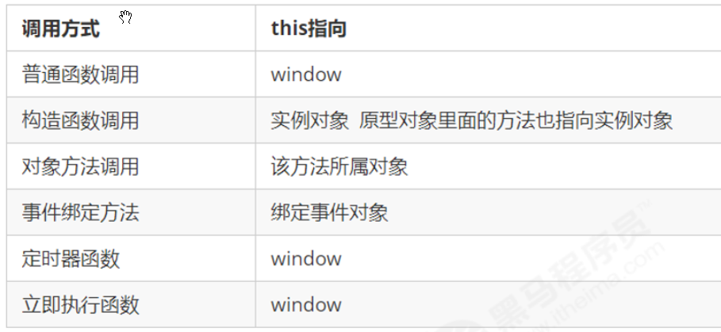

#### 函数的定义和调用

1. 函数定义的三种方式

     ```
     function fn(){}  // 关键字
     var fn2 = function(){}  // 函数表达式
     var fn3 = new Function(‘a’) // Function 关键字
     
     fn.__proto__
     fn.prototype
     // 函数也是对象， 底层是new构造函数的方式， 创建了一个函数对象， 所以它有__proto__属性， 既然是函数就有prototype属性
     ```

2. 万物皆对象

     ```javascript
     // 万物皆对象
     var num = 1; // new Number()
     var str = 'aa'; // new String()
     var flag= true; // new Boolean()
     var arr = []; //new Array()
     var obj = {}; // new Object()
     function fn1(){}; // new Function()
     console.dir(Function.prototype)
     ```

3. 函数的几种调用方式  以及里面的this值

     ```javascript
     // 函数的不同调用方式决定了this 的指向不同
     // 1. 普通函数 this 指向window
     function fn() {
         console.log('普通函数的this' + this);
     }
     window.fn();
     // 2. 对象的方法 this指向的是对象 o
     var o = {
         sayHi: function() {
             console.log('对象方法的this:' + this);
         }
     }
     o.sayHi();
     // 3. 构造函数 this 指向 ldh 这个实例对象 原型对象里面的this 指向的也是 ldh这个实例对象
     function Star() {};
     Star.prototype.sing = function() {
     
     }
     var ldh = new Star();
     // 4. 绑定事件函数 this 指向的是函数的调用者 btn这个按钮对象
     var btn = document.querySelector('button');
     btn.onclick = function() {
         console.log('绑定时间函数的this:' + this);
     };
     // 5. 定时器函数 this 指向的也是window
     window.setTimeout(function() {
         console.log('定时器的this:' + this);
     
     }, 1000);
     // 6. 立即执行函数 this还是指向window
     (function() {
         console.log('立即执行函数的this' + this);
     })();
     ```

       

#### 改变函数内部的this指向

 1.  call，apply，bind

     ```javascript
      // call 方法
     var o = {
           name: 'andy'
       }
       
       function fn(a, b) {
           console.log(this);
           console.log(a + b);
       
       };
       fn.call(o, 1, 2);  // 首先是调用函数， 其次是改变了函数里面的this指向， 原来的普通调用fn() 里面的this指向window， 现在指向o
       
       // call的应用--- 实现继承
       function Father(uname, age, sex) {
           this.uname = uname;
           this.age = age;
           this.sex = sex;
       }
       
       function Son(uname, age, sex) {
         // 这一步操作 是将SON创建出来的实例对象son传入Father函数里面，并让this指向它； 这样实现了 son可以继承Father里面的几个属性
           Father.call(this, uname, age, sex);
       }
       var son = new Son('刘德华', 18, '男');
       console.log(son);
     ```

     ```javascript
     // apply 方法  
     var o = {
           name: 'andy'
       };
       
       function fn(arr) {
           console.log(this);
           console.log(arr); // 'pink'
       
       };
       // 作用和call一样， 但是参数传递的形式不一样， apply第二个参数必须是数组
       fn.apply(o, ['pink']);
       
       // 3. apply 的主要应用 比如说我们可以利用 apply 借助于数学内置对象求数组最大值 
       // Math.max();
       var arr = [1, 66, 3, 99, 4];
       var arr1 = ['red', 'pink'];
       // var max = Math.max.apply(null, arr);
       var max = Math.max.apply(Math, arr);
       var min = Math.min.apply(Math, arr);
       console.log(max, min); // Math.max([1,2,3])
     ```

     ```javascript
       // 3. bind()  方法   绑定的意思
       // 不会调用原来的函数， 会返回 原函数被改变this之后的 新函数
       // 一般定义一个函数表达式  用 bind的返回值 给它赋值
       var o = {
           name: 'andy'
       };
       
       function fn(a, b) {
           console.log(this);
           console.log(a + b);
       };
       var f = fn.bind(o, 1, 2);
       f();
       
       // bind的应用，
       var btns = document.querySelectorAll('button');
       for (var i = 0; i < btns.length; i++) {
           btns[i].onclick = function() {
               this.disabled = true;
               setTimeout(function() {
                   this.disabled = false;
               }.bind(this), 2000);
           }
       }
     ```


#### 严格模式

 1.  消除了js语法的一些不合理，不严谨之处；减少一些怪异行为；提高编译效率，增加运行速度；

 2.  开启严格模式； 分为脚本开启， 和函数开启严格模式两种情况

     + ```javascript
       // 终极写法
       ;(function(){
         'use strict';
         
       })();
       ```

     3. 严格模式下的一些变化

         1. 变量必须先声明后使用
         2. 不允许删除变量
         3. 全局作用域中的函数普通调用 this 是 undefined
         4. 构造函数的调用必须使用new
         5. 定时中的this还是一样， 指向window


#### 高阶函数

 1.  高阶就是把函数 当做参数 或者 返回值

     ```javascript
       // 1. 函数作为参数, 常见的回调函数
       function eat(callback) {
         setTimeout(function () {
           console.log('吃完了')
           callback && callback()
         }, 1000)
       }
       
       //函数调用时，将这个匿名函数当做一个参数，一个实参，传递到这个函数里面，用形参callback接收 
       eat(function () {
         console.log('去唱歌')
       })
       
       // 2. 函数作为返回值
       // 求两个数的和， 只能传递一个参数
       function getFun(n) {
         return function (m) {
           return n + m;
         }
       }
       var fn100 = getFun(100); // 这个fn100 就是getFun函数调用之后的返回值
       console.log(fn100(1)) //这个时候计算的是 100 + 1 和
     ```


#### 闭包

1. 闭包就是函数(简单理解为定义在一个函数内部的函数)； 内层函数可以访问外层函数里面的变量

2. 正常情况下， 函数调用结束后，函数内部的局部变量就会被销毁，但闭包不会销毁

3. 闭包的作用，1. 可以在函数外面读取函数内部成员， 2. 让函数内成员始终存活在内存中

   ```javascript
   <button>点击</button>
   <script>
     var button = document.querySelector('button');
   
     function fn() {
       var num = 10;
       return function () {
         num++;
         console.log(num);
       }
     }
     // fn() 调用结束后 内部的局部变量num应该被销毁
     // 但是这里产生了闭包， 让变量num一直保存在内存中，所以打印了10
     // 正常的情况下，函数一调用结束，里面的变量都会销毁，但闭包可以讲变量保存在内存里面
     // 学会调试功能，  看到clouser闭包的产生
     var f = fn();
     f();
     button.addEventListener('click', function(){
       f();
     })
   ```

    ```javascript
   // 闭包应用-点击li输出当前li的索引号
   // 1. 我们可以利用动态添加属性的方式
   // 我们之前是利用自定义属性的发送 setAttribute('data-index', i)
   var lis = document.querySelector('.nav').querySelectorAll('li');
   for (var i = 0; i < lis.length; i++) {
       lis[i].index = i;
       lis[i].onclick = function() {
           // console.log(i);
           console.log(this.index);
       }
   }
   
   // 2.1 利用闭包的方式得到当前小li 的索引号
   for (var i = 0; i < lis.length; i++) {
     // 利用for循环创建了4个立即执行函数
     // 立即执行函数也产生了闭包，因为立即执行函数里面的任何一个函数都可以使用它的i这变量
     (function(i) {
         // console.log(i);
         lis[i].onclick = function() {
             console.log(i);
         }
     })(i);
   }
    ```
    ```javascript
   //闭包在定时器中的应用
   for (var i = 0; i < 3; i++) {
     setTimeout(function () {
       console.log(i)
     }, 0)
   }
   
   for (var i = 0; i < 3; i++) {
     (function (index) {
       setTimeout(function () {
         console.log(index)
       }, 0)
     })(i)
   }
    ```


#### 递归

1. 函数内部自己调用自己, 这个函数就是递归函数

2. 递归函数的作用和循环效果类似， 由于递归容易发生"栈溢出(stack overflow)"的错误， 所以一定注意加上退出条件

   ```javascript
    // 利用递归函数求1~n的阶乘 1 * 2 * 3 * 4 * ..n
    function fn(n) {
        if (n == 1) {
            return 1;
        }
        return n * fn(n - 1);
    }
    console.log(fn(3));
   ```

    ```javascript
    //利用递归求斐波那契数列  1、1、2、3、5、8、13、21...
    function fb(n) {
        if (n === 1 || n === 2) {
            return 1;
        }
        return fb(n - 1) + fb(n - 2);
    }
    console.log(fb(3));
    ```

   >  递归遍历数据，常用！！！ 在一些框架的组件化开发中，  树形控件必须使用这种递归的写法


#### 扩展---自己封装判断数据类型函数

```javascript
var oP = Object.prototype,
toString = oP.toString;

function typeOf(value) {
    if (null === value) {
        return 'null';
    }

    var type = typeof value;
    if ('undefined' === type || 'string' === type) {
        return type;
    }

    var typeString = Object.prototype.toString.call(value);
    switch (typeString) {
    case '[object Array]':
        return 'array';
    case '[object Date]':
        return 'date';
    case '[object Boolean]':
        return 'boolean';
    case '[object Number]':
        return 'number';
    case '[object Function]':
        return 'function';
    case '[object RegExp]':
        return 'regexp';
    case '[object Object]':
        if (undefined !== value.nodeType) {
            if (3 == value.nodeType) {
                return (/\S/).test(value.nodeValue) ? 'textnode': 'whitespace';
            } else {
                return 'element';
            }
        } else {
            return 'object';
        }
    default:
        return 'unknow';
    }
}
```


