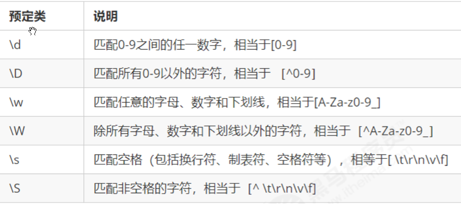

#### 什么是正则表达式

1. 正则表达式是对字符串操作的一种逻辑公式， 用事先定义好的一些特定字符、及这些特定字符的组合，组成一个“规则字符串”，这个“规则字符串”用来表达对字符串的一种过滤逻辑；  类似这种  `/^[a-zA-Z]{5,}\w+$}/`
2. 工作中一般是网上去查找别人写的比较好的完整的正则表达式，拿过来直接使用，偶尔修改里面的一两个条件，要能看懂正则表达式并做一些简单修改即可
3. 正则表达式是一个对象


#### js中正则表达式

1. 创建正则表达式的两种方式

     ```javascript
     // 坑： 正则表达式里面不需要加引号
     // 字面量
     var pattern1 = /123/;
     // 构造函数方式
     var pattern2 = new RegExp(/123/);
     
     //正则表达式的测试
     pattern1.test('abc');
     // 含义是用户输入的字符串 'abc' 是不是符合我正则表达式的规则；这个方法返回的是true/false
     ```


#### 正则表达式中的特殊字符

1. 边界符  ^ 表示以谁开始， $表示以谁结束， 两个一起使用表示精确匹配

     ```javascript
     // 边界符 ^ $ 
     var rg = /abc/; // 正则表达式里面不需要加引号 不管是数字型还是字符串型
     // /abc/ 只要包含有abc这个字符串返回的都是true
     console.log(rg.test('abc'));
     console.log(rg.test('abcd'));
     console.log(rg.test('aabcd'));
     console.log('---------------------------');
     var reg = /^abc/;
     console.log(reg.test('abc')); // true
     console.log(reg.test('abcd')); // true
     console.log(reg.test('aabcd')); // false
     console.log('---------------------------');
     var reg1 = /^abc$/; // 精确匹配 要求必须是 abc字符串才符合规范
     console.log(reg1.test('abc')); // true
     console.log(reg1.test('abcd')); // false
     console.log(reg1.test('aabcd')); // false
     console.log(reg1.test('abcabc')); // false
     ```

2. 中括号 []   表示有一系列的字符可供选择，只要匹配其中一个就可以了

     ```javascript
     // 1. [] 里面的 -  表示范围符
     // 2. 中括号里面的 ^ 这个符号 表示取反的意思
     
     
     //var rg = /abc/;  只要包含abc就可以 
     // 字符类: [] 表示有一系列字符可供选择，只要匹配其中一个就可以了
     var rg = /[abc]/; // 只要包含有a 或者 包含有b 或者包含有c 都返回为true
     console.log(rg.test('andy'));
     console.log(rg.test('baby'));
     console.log(rg.test('color'));
     console.log(rg.test('red'));
     var rg1 = /^[abc]$/; // 三选一 只有是a 或者是 b  或者是c 这三个字母才返回 true, 这个只能匹配一个字符 
     console.log(rg1.test('aa'));  // aa有两个字符了，所以不行
     console.log(rg1.test('a'));
     console.log(rg1.test('b'));
     console.log(rg1.test('c'));
     console.log(rg1.test('abc'));
     console.log('------------------');
     
     var reg = /^[a-z]$/; // 26个英文字母任何一个字母返回 true  - 表示的是a 到z 的范围  
     console.log(reg.test('a'));
     console.log(reg.test('A'));
     // 字符组合
     var reg1 = /^[a-zA-Z0-9_-]$/; // 26个英文字母(大写和小写都可以)任何一个字母返回 true  
     console.log(reg1.test('a'));
     console.log(reg1.test('-'));
     console.log('----------------');
     // 如果中括号里面有^ 表示取反的意思 千万和 我们边界符 ^ 别混淆
     var reg2 = /^[^a-zA-Z0-9_-]$/;
     console.log(reg2.test('a'));
     console.log(reg2.test('-'));
     ```

3. 量词符，  用来设定某个模式出现的次数

   1. *表示重复0到n次    等价于  {0, }

   2. \+表示重复1到n次    等价于  {1, }

   3. ?表示重复0到1次     等价于  {0,1}

      ```javascript
      var p1 = /[0-9]{3}|[a-z]{4}/; //表示匹配3个数字或者4个字母
      var p2 = /[abc]+/;  // 表示匹配 abc任意字符 出现1次或者多次
      ```

4. 预定义类，  就是常见模式的简写

     1. 

     2. ```javascript
          // 座机号码验证:  全国座机号码  两种格式:   010-12345678  或者  0530-1234567
          // 正则里面的或者 符号  |  
          // var reg = /^\d{3}-\d{8}|\d{4}-\d{7}$/;
          var reg = /^\d{3,4}-\d{7,8}$/;
          ```

5. 正则替换 replace

     ```javascript
     // 之前在js基础第六天学习的  字符串的替换方法
     var str = 'andy和red';
     var newStr = str.replace('andy', 'baby');
     
     // 去除字符串里面的空格
     '  he l l o  '.replace(/\s/ig, '')
     ```

6.  | 表示或者

7.  () 小括号 表示 分组


#### 难点拓展---小括号

```javascript
// 1. 限定量词的作用范围, 一般只能重复单个字符， 加上小括号就可以重复多个字符
var pattern1 = /(abc)?/  表示abc整体 出现0次或者1次
var pattern1 = /(abc)+/  表示abc整体 出现1次或者n次
var pattern1 = /(abc)*/  表示abc整体 出现0次或者n次

// 2. 限定多选结构的范围
var pattern2 = /(abc|cde)/
pattern2.test('abc') // true
pattern2.test('cde') // true
pattern2.test('sss') // false

// 3. 分组捕获---重点
// 分组匹配 表示从 完全匹配到的结果(这里是test001)里面，再查找\d+模式匹配的字符串
 var reg = /test(\d+)/;
 var str = 'new test001 test002';
 console.log(str.match(reg));//["test001", "001", index: 4, input: "new test001 test002"]

 var reg = /test(\d)+/;
 var str = 'new test001 test002';
 console.log(str.match(reg));//["test001", "1", index: 4, input: "new test001 test002"]

// 上面的 问题是由于 默认情况下匹配模式都是贪婪模式， 它的机制是尽可能多的去匹配， 所以是1； 加上？ 就是非贪婪模式
 var reg = /test(\d)+?/;
 var str = 'new test001 test002';
 console.log(str.match(reg));//["test001", "0", index: 4, input: "new test001 test002"]
```


#### 课后扩展

```javascript
// html文件里面  编辑器要匹配 所有html文件里面的标签
\w+  \d  <.+?>


//if(p7.test("string")){...};//使用方法
var p1=/[ab]c/gi;//匹配ac或者bc
var t="aCthiisac";
console.log(p1.test(t));
console.log(p1.exec(t));

//^$开始结束的含义，ig模式的用法
var p2=/^He$/i;
var str1="twere what hee my";
console.log(p2.test(str1));

var p2=/\[bc\]a/i;//匹配第一个[bc]at
var p3=/\d{3}-\d{2}-\d{4}/;//对应的字符串"000-00-0000";
var p4=/^[\w-]+(\.[\w-]+)*@[\w-]+(\.[\w-]+)+$/;
var p5=/^\d(\.[\w-]+)+\d$/;//(\.[\w-]+)+ 表示至少一个.且后面字符一个或多个
var t1="1.a-3";
console.log(p5.test(t1));
//分组
var p6=/mom( and dad( and baby))?/gi;
var t2="mom and dad and baby";
console.log(p6.exec(t2));
var p7=/h(elp)?[\w]$/;
var t3="helpa";
console.log(p7.test(t3));
console.log(p7.exec(t3));
var p8=/\d{15}|\d{18}$/; //身份证验证
var p9=/\d{3}|[a-z]{4}/; //匹配3个数字或者4个字母

var reg=/(A+)((B|C|D)+)(E+)/gi; //该正则表达式有4个分组
var str="abcde";
console.log(reg.exec(str));//返回的数组中,第一个元素为完整的字符串arr[0]

var testStr="now test001 test002";
var re=/test(\d+)/gi;
var r=re.exec(testStr);
console.log(r);
console.log('r[0]=',r[0],'r[1]=',r[1]);

//匹配自己的邮箱  163\.com 表示匹配 163.com 这个词组
var pattern=/^\w[\w-]+\@163\.com/;
var str="leko-ljl@163.com";
console.log(pattern.test(str));

var p3=/^[A-Z][a-z]+\s*\d{1,}/;
var str2="Ubuntu 8";
console.log(p3.test(str2));
//整个字符串的完整匹配
var p4=/\d+/;
var arr=p4.exec(str2);
console.log(arr[0]);
//第一个子匹配，arr[0]表示整个字符串，也就是表达式的完整匹配
var p5=/^[A-Z][a-z]+\s*(\d{1,})$/;
console.log(p5.exec(str2));
```

